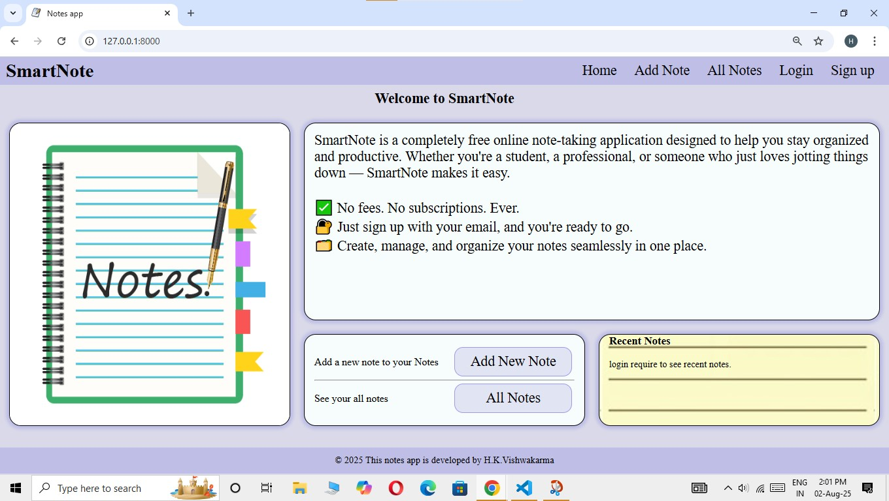
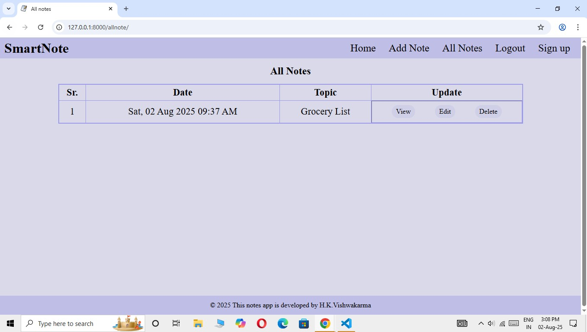

#  Django Notes App

A simple and secure Notes application built with **Django**.  
Users can **register, log in, add notes, view all notes, and manage personal notes** in one place.  

---

##  Features
-  User registration & login (authentication system)
-  Create, read, update, and delete notes
-  User-specific notes (each user sees only their own notes)
-  Responsive and clean UI
-  Secure with Django’s authentication

---

##  Tech Stack
- **Backend:** Django (Python)
- **Frontend:** HTML, CSS (Bootstrap)
- **Database:** SQLite (default, can be replaced with PostgreSQL/MySQL)
- **Authentication:** Django’s built-in auth system

---

##  Installation Guide

### 1. Clone the Repository
```bash
git clone https://github.com/yourusername/django-notes-app.git
cd django-notes-app

### 2. Create Virtual Environment
python -m venv venv
source venv/bin/activate   # Linux / Mac
venv\Scripts\activate      # Windows


### 3. Install Dependencies
pip install -r requirements.txt


### 4. Set Up Database
python manage.py makemigrations
python manage.py migrate


### 5. Create Superuser (optional, for admin access)
python manage.py createsuperuser


### 6. Run the Server
python manage.py runserver
Visit  http://127.0.0.1:8000 in your browser.


## Screenshots

### Homepage


### Home Page After Login


### Login Page


### Sign Up Page


### Add Note Page


### Success Page


### All Note Page


### View Full Note Page


## Project Structure
django-notes-app/
│── notes/                # App folder
│── projectname/          # Project folder
│── templates/            # HTML templates
│── static/               # CSS, JS, images
│── screenshots/          # App screenshots
│── db.sqlite3            # Database file
│── manage.py
│── requirements.txt
│── README.md


## Author
Hemant Kumar Vishwakarma
